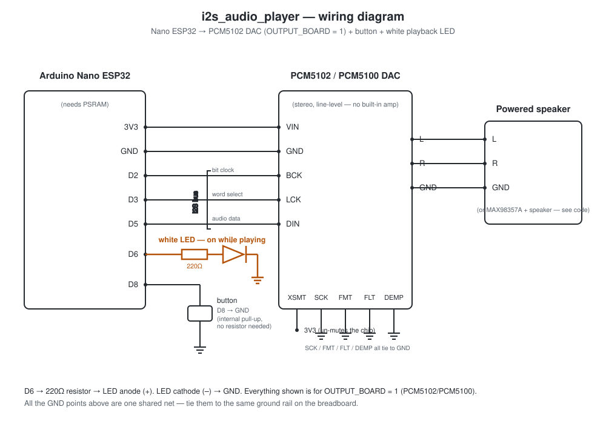

# i2s_audio_player

Sketch B — the player (the object with the speaker). Waits for a clip
pushed over WiFi from the recorder board, then plays it once when the
button is pressed. See the comment block at the top of
`i2s_audio_player.ino` for the full story.

## Wiring

- Nano ESP32 ↔ PCM5102 DAC: I2S (BCK/LCK/DIN) + power (3V3/GND)
- PCM5102 → powered speaker (L/R/GND)
- Button: D8 → GND (internal pull-up, no resistor needed)
- White "now playing" LED: D6 → 220Ω resistor → LED anode; LED cathode → GND
